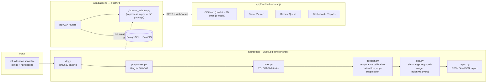
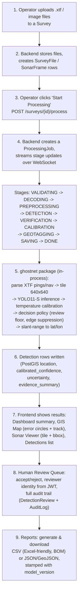

# GhostNet AI — Complete Project Overview

> **Purpose of this document**: a single, self-contained reference to the entire GhostNet AI project — problem, architecture, AI/ML pipeline, backend, frontend, data contracts, end-to-end workflow, user flow, deployment, and current status. Written so that any AI assistant or new team member can understand the whole project without exploring the codebase first.
>
> Project root: `ghostnet-ai-ghostnet-full/` · Competition: **Smart India Hackathon, Problem Statement SIH26057**

---

## 1. What GhostNet AI Is

**GhostNet AI** is an AI system that detects underwater marine debris — especially "ghost nets" (abandoned fishing nets that keep killing marine life with nobody tending them) — from **side-scan sonar imagery**, and reports each detection with a **calibrated confidence score**, a **geographic position with an honest error radius**, and **supporting evidence**, instead of a black-box "found it" pin.

**Elevator pitch**: Feed the system raw side-scan sonar survey data (`.xtf` files). It parses the sonar pings, tiles the acoustic imagery, runs a trained object detector to distinguish natural seafloor texture from artificial anomalies (nets, pots, wrecks, debris, planes), calibrates how confident it really is, geolocates each detection using the sonar's own navigation data and slant-range correction, and surfaces the result to a human reviewer on a map, a sonar-image viewer, and in exportable reports (CSV/GeoJSON).

**Core differentiator (stated repeatedly across the project's docs)**: the system is built to be *honestly uncertain*. It:
- Publishes its false-alarm rate rather than hiding it.
- Shows **error circles**, not precise pins, because sonar geolocation has real uncertainty.
- Reports a negative research result (an experiment that didn't work) instead of suppressing it.
- Never fabricates a coordinate, dimension, or confidence number it doesn't have evidence for.

### Who it's for / project context
Built for **SIH26057**, a 2-person core build (contract-driven, single repo):
- **Member 1** — AI/ML/sonar pipeline (`ai/` folder).
- **Member 2** — backend, frontend, database, GIS map (`app/` folder).
- Members 3–4 — pitching/presentation and written content (non-code).

Git branch model: `main` (demo-ready), `develop` (integration), `member1-ai`, `member2-app`. The two halves of the system integrate strictly through a **frozen JSON contract** (see §5) so the AI side and the app side can be built independently and plugged together.

Key top-level docs to know about:
| File | Purpose |
|---|---|
| `README.md` | Repo map, setup, contract rules |
| `PROJECT_PRIMER.md` | From-zero glossary of sonar/ML/project terms |
| `docs/TEAM_DOC_1_PROJECT.md` / `docs/TEAM_DOC_2_TECH.md` | "Dossier + tech reference," written for briefing teammates — includes hard rules like "never state a number not in this document" and per-class accuracy tables |
| `docs/HANDOFF.md` | Member1 → Member2 integration contract handoff |
| `docs/SIH26057_GhostNet_AI_Final_Master_Plan.md` | ~3,600-line master build plan: architecture, stack, timeline, UI/UX, security |
| `docs/KNOWN_ISSUES.md` | Bug log, mostly resolved (see §9) |
| `docs/DEMO_RUNBOOK.md`, `docs/OPERATOR_MANUAL.md`, `docs/COMMANDS.md` | How to actually run/demo the system |

---

## 2. System Architecture (High Level)

**Key architectural decision**: the AI pipeline is **not** a separate microservice called over HTTP. The backend does `pip install -e ai/ --no-deps` and imports the `ghostnet` Python package **in-process**, wrapped by `app/backend/app/services/ghostnet_adapter.py` (`GhostNetAdapter`). At startup it checks the AI package's `CONTRACT_VERSION` major version against what the backend expects and **refuses to start on a mismatch** rather than silently degrading. If the `ghostnet` package or its trained weights aren't available (e.g., in the lightweight Docker image), the backend falls back to a `MockAIAdapter` stamped with `model_version: "mock-ghostnet-dev-v0"` — this is what the Docker Compose stack runs by default; it is explicitly **not** real detection.

---

## 3. AI/ML Pipeline (`ai/`)

### 3.1 Stack
- Python 3.12, PyTorch 2.13.0+cu126 (dev), `>=2.6` for consumers
- `ultralytics` 8.4.134 (YOLO11)
- `opencv-python-headless`, `pyproj` (proper WGS84 geodesy, not flat trigonometry)
- scikit-learn / pandas / scipy for calibration
- **Trained on a single NVIDIA RTX 3050 Laptop GPU, 4GB VRAM** — this is the binding hardware constraint across the whole project (small batch size, the "S" model size, no despeckling at inference time, etc.)

### 3.2 Model
- **YOLO11-S** (Ultralytics), transfer-learned from COCO-pretrained `yolo11s.pt`
- Input: 640×640 image tiles
- **5 classes** (fixed index order — part of the wire format): `wreck`, `plane`, `debris`, `ghost_pot`, `ghost_net`
- Shipped weights: **`gv5-yolo11s`** at `ai/models/trained/ghostnet.pt` (~19MB) + a `.json` provenance sidecar
- Six training generations (`gv1`…`gv6`) exist. **gv6** (trained with synthetic ghost-net data) was tested and **explicitly not promoted** — `ghost_net` recall stayed at exactly 0.000. Root cause documented in `docs/EXPERIMENT_GV6.md`: a net lying flat on the seabed gives one weak acoustic cue, versus a crab pot's strong rigid-blob-plus-shadow signature.

### 3.3 Per-class results (gv5, 4,346 held-out frames)
| Class | mAP50 | n | Note |
|---|---|---|---|
| `debris` | 0.869 | 629 | 615 of these from a single SubPipe survey — caveat on generalization |
| `ghost_pot` | 0.314 | 567 | **The headline result** — real derelict fishing gear |
| `wreck` | 0.279 | 836 | |
| `plane` | 0.292 | 9 | n too small to ever quote confidently |
| `ghost_net` | 0.009 (recall 0.000) | 36 | Does not work in the shipped model |

- **Calibration**: temperature scaling, T = 2.722, ECE improved 0.218 → 0.089. Max calibrated confidence ever produced ≈ 0.728, so the `uncertainty: low` band (threshold 0.75) is currently **unreachable** in practice.
- **False-alarm rate**: 7.82% on 2,930 held-out unannotated tiles at the deployed raw threshold of 0.10.

### 3.4 A genuine research finding: segmentation beats detection for ghost nets
A follow-up experiment (`docs/D2_SEGMENTATION_SUMMARY.md`) reproduced a finding from Microsoft/WWF's **GhostNetZero** project: reformulating `ghost_net` as **instance segmentation** (YOLO11-S-seg, 425 hand-drawn polygons over 73 chips) instead of box detection raised box recall from 0.000 to ~0.49 and centroid detection rate to ~0.61. This is a small-sample (11 test chips), unvalidated-at-scale result, but promising enough that the team reached out to the GhostNetZero authors (WWF Germany / Microsoft AI for Good Lab) for a data-sharing conversation — see `docs/GN0_MEETING_CALL_SHEET.md` and `docs/OUTREACH_GN0_REPLY.md`.

### 3.5 Input data format
Real **XTF (eXtended Triton Format)** side-scan sonar files: pings + per-ping navigation data.
- `demo/NBP0505_line01B_demo.xtf` — real 2005 Nathaniel B. Palmer research cruise data, Golfo de Penas, Chile (40 frames, 2 detections after bugfixes) — the primary demo survey.
- `demo/xtf/*.xtf` — four synthetic-container/real-imagery per-class fixtures: `wrecks_demo_fixture.xtf`, `aircraft_demo_fixture.xtf`, `debris_demo_fixture.xtf`, `ghost_gear_demo_fixture.xtf`.
- **JSF format is explicitly not implemented** — no sample data existed to test against.

### 3.6 Training data (18,310 images, 10 public sources, no proprietary data)
| Source | Images | Notes |
|---|---|---|
| AI4Shipwrecks | 6,976 | Lake Huron wrecks |
| GhostVision | 6,655 | Delaware Bay crab pots, CC-BY-SA |
| China-Offshore-SSS-AI | 2,072 | Pipeline survey; hard negatives + 73 real fishing-net chips |
| SubPipe | 2,049 | CC BY 4.0; source of the `debris` class |
| SCTD | 327 | Pascal VOC format |
| GHOSTNET-HAND (self-annotated) | 73 | 298 hand-drawn boxes |
| GHOSTNET-SYNTH (self-generated) | 1,364 | Synthetic composites, **train-only** |

`docs/dataset.md` and the family of `docs/SIH26057_*.md` files are a large **dataset-source scouting catalog** (per-source category/size/license/leakage-risk notes) rather than narrative documentation.

### 3.7 The `ai/ghostnet/` package (what ships — ~3,272 lines, 13 modules)
| Module | Responsibility |
|---|---|
| `infer.py` | `detect()` / `detect_batch()` — single/batch tile inference |
| `survey.py` | `detect_survey()` — runs inference across a whole XTF file |
| `xtf.py` | Raw sonar container parsing, per-ping nav extraction |
| `geo.py` | Slant-range → ground-range conversion, lat/lon via `pyproj` |
| `decision.py` | Calibration application, review-floor logic, edge-sliver suppression |
| `shadow.py` | Acoustic shadow evidence extraction |
| `dropout.py` | Handles sonar dropout/gaps |
| `preprocess.py` | Tiling and image prep |
| `taxonomy.py` | The 3 class vocabularies used across the project |
| `contract.py` | Frozen dataclasses defining the wire format — **no pydantic/FastAPI dependency**, deliberately decoupled from the backend |
| `report.py` | CSV/GeoJSON export |
| `config.py` | All decision constants (thresholds etc.) |

`ai/scripts/` (~33 scripts) is factory/tooling code that does **not** ship: per-format dataset importers (`voc_to_yolo.py`, `masks_to_yolo.py`, `import_jsonl.py`, `subpipe_to_yolo.py`, …), `build_dataset.py` (leakage-safe, group-based train/val split), `train.py` / `train_all.ps1`, `fit_calibration.py`, `evaluate_background.py`, `export_schemas.py` (generates `contracts/*.json` from `contract.py`), `synth_ghost_net.py` (synthetic net compositing), `xtf_to_frames.py`.

---

## 4. AI ↔ App Contracts (`contracts/`)

These JSON Schemas are **generated** from `ai/ghostnet/contract.py` by `ai/scripts/export_schemas.py`. Hand-editing them is forbidden; CI enforces `--check` regeneration. Current version: **1.2.0** (some older docs still reference 1.1.0).

### `ai-input.schema.json`
- `survey_id`, `frame_id`, `image` (a multipart upload or URL — **never** a filesystem path)
- Optional geometry needed for geolocation: `latitude`, `longitude`, `heading_deg`, `altitude_m` (towfish height above seabed — required for slant-range correction), `nadir_col`, `range_resolution_m`, `along_track_res_m`, `layback_m`, `nadir_row`
- Coordinates are only emitted in the output when **all** of lat/lon/heading/altitude/nadir_col/range_resolution are present — no partial/guessed geolocation.

### `ai-output.schema.json`
- Top level `FrameResult`: `survey_id`, `frame_id`, `detections[]`, `provenance`, `warnings[]`, `contract_version`, `frame_position` (added in 1.1.0, used to draw the vessel track)
- `Detection`:
  - `detection_id`, `class` (`ghost_net | debris | natural | unknown`)
  - `raw_score` (diagnostic only — **never shown to users**)
  - `calibrated_confidence` (the number to display/threshold on)
  - `uncertainty` (`low | medium | high`)
  - `bbox` `[x, y, w, h]`, `mask` (nullable — unused; segmentation output was cut from the shipped pipeline)
  - `latitude` / `longitude` (nullable — never fabricated), `position_error_m`, `localization` (`frame-level | ping-level | none`)
  - `dimensions` (`width`, `length`, `status: estimated | measured | unavailable`)
  - `review_status`, `model_version`
  - `evidence_summary` (`artificial_verification`, `shadow_context`, `notes`)

### `ai-error.schema.json`
- `error` enum: `bad_request | unreadable_image | internal_error | out_of_memory`
- `message`, `survey_id`, `frame_id`, `contract_version` (const `"1.2.0"`)
- Important nuance: degraded conditions (no weights loaded, no GPU, missing nav data) are **not** treated as errors — they return valid output with `warnings[]` populated instead.

---

## 5. Backend (`app/backend`)

**Stack**: FastAPI 0.115.6 + Uvicorn · SQLAlchemy 2.0.36 + GeoAlchemy2 ORM · **PostgreSQL + PostGIS** (`detections.location` is a `geometry(Point, 4326)` column) · Alembic migrations · JWT auth (`python-jose` + bcrypt) with refresh tokens and password-reset tokens · **RBAC** (`admin / operator / reviewer / viewer`) · rate limiting via `slowapi` · full audit logging.

Entry point: `app/backend/app/main.py` — FastAPI app with CORS, rate-limit middleware, 12 routers mounted under `/api/v1`.

### 5.1 Alembic migrations
`0001_initial_schema` → `0002_sonar_frame_geometry` → `0003_detection_ref_unique_per_frame` → `0004_rbac_audit_rate_limit`

### 5.2 Data models (`app/backend/app/models/`)
`User`, `RefreshToken`, `PasswordResetToken`, `AuditLog`, `Survey` (id, name, source, sonar_type, status, created_by_user_id), `SurveyFile`, `SonarFrame`, `Detection` (detection_ref, survey/frame/source_file FKs, detection_class, raw_score, calibrated_confidence, uncertainty, bbox_x/y/w/h, mask_reference, latitude/longitude + PostGIS `location`, position_error_m, localization_method, depth/width/length/area/dimension_status, priority, review_status, model_version, evidence_summary JSON), `DetectionReview`, `ProcessingJob`, `Report`.

### 5.3 API routes (`app/backend/app/api/v1/*.py`, ~38 handlers, 12 routers)
| Router | Endpoints |
|---|---|
| `health` | `GET /health`, `/liveness`, `/readiness` |
| `auth` | `POST /login`, `/refresh`, `/logout`, `/reset-password`, `/change-password`; `GET /me` |
| `users` | CRUD + reset-password |
| `surveys` | `POST/GET/PATCH/DELETE /surveys`, `GET /surveys/{id}` |
| `files` | `POST/GET /surveys/{id}/files` |
| `processing` | `POST /surveys/{id}/process`, `GET /jobs/{id}`, `GET /surveys/{id}/jobs/active\|latest\|jobs`, `POST /jobs/{id}/cancel` |
| `detections` | `GET /detections`, `GET /detections/{id}`, `POST /detections/{id}/review`, `GET /detections/{id}/reviews` |
| `maps` | `GET /maps/surveys/{id}/detections` |
| `reports` | `POST /reports`, `GET /reports`, `GET /reports/{id}`, `GET /reports/{id}/download` |
| `dashboard` | `GET /dashboard/summary` |
| `analytics` | `GET /analytics/summary` |
| `frames` | `GET /frames/{id}/image` |
| `ws` | WebSocket — realtime processing progress |

### 5.4 How it invokes the AI pipeline
Not a network call — `ghostnet_adapter.py`'s `GhostNetAdapter` imports the `ghostnet` package **in-process** (installed via `pip install -e ai/ --no-deps` from the same repo), calling `warmup()` and `detect()`/`detect_survey()` directly. It verifies the AI contract's major version at startup and refuses to boot on mismatch. It never substitutes `depth` for `altitude` or `range` for `range_resolution` — that would silently corrupt geolocation rather than gracefully degrade it. When the real package/weights are unavailable, it swaps in `MockAIAdapter` (`model_version: "mock-ghostnet-dev-v0"`).

---

## 6. Frontend (`app/frontend`)

**Stack**: Next.js 14.2.35 (App Router) · React 18.3.1 · TypeScript 5.5.4 · Tailwind CSS 3.4.10 · TanStack React Query 5 (server state) · Zustand (client state) · react-hook-form + Zod (forms/validation).

**Maps (2D)**: Leaflet 1.9.4 + react-leaflet 4.2.1 + react-leaflet-cluster.

### 6.1 Pages / routes (`src/app/`)
- Public landing page (`page.tsx`) with a cinematic 3D/shader "hero" sequence
- `lab/hero/page.tsx` — standalone 3D hero prototype route
- Authenticated app (`app/app/`): `dashboard`, `surveys` (+ `[surveyId]`), `map`, `sonar` (+ `[detectionId]`), `detections` (+ `[detectionId]`), `review` (+ `[detectionId]`), `reports` (+ `[reportId]`)

These correspond to the **7 numbered operator screens**: Dashboard → Surveys → Sonar Viewer → Detections → Review Queue → GIS Map → Reports.

### 6.2 Key components
- `MapView.tsx` — Leaflet map; detections drawn as **error circles, not pins**; vessel track as a polyline
- `three/` — `Vessel.tsx`, `SurveyRoute.tsx`, `CoverageSwath.tsx`, `DetectionMarker.tsx`, `SonarSweep.tsx` (the 2D/3D map toggle)
- `SonarViewer.tsx` — raw 640×640 sonar tile with the drawn bounding box overlay
- `EvidenceSummary.tsx`, `ReviewPanel.tsx` — human review UI
- `Chart.tsx`, `MeterBar.tsx`, `KpiCard.tsx` — dashboard statistics

### 6.3 Landing-page "hero" (3D underwater sequence)
`src/features/landing/` (`HeroSection.tsx`, `HeroSonar.tsx`, `hero/scene.ts`) + `src/components/three/hero/` (`HeroScene.tsx`, `Towfish.tsx`, `TowCable.tsx`, `SonarReturns.tsx`, `MarineSnow.tsx`, `ModelSlot.tsx`, `stages.ts`) implement a scroll-driven, raymarched-shader water/deployment animation (waves, caustics, light absorption, god rays). Fully specified numerically in `docs/GhostNet-AI_Technical_Ocean_Underwater_Rendering_Specification.md` and in `WATER_PROMPT.md` (repo parent folder) — the latter is a full shader-reproduction spec with every parameter lifted verbatim from the actual code. `docs/HERO_VESSEL_MODEL_BRIEF.md` gives 3D-model-generation prompts for the survey vessel and towfish. `docs/HERO_UIUX_PROMPT.md` is a self-contained brief for building the full marketing site around this hero, citing real project figures (0.91 calibrated confidence example, ±24m error radius, 7.0% vs 56.5% polygon-vs-box area).

`app/design/ghostnet-canva-brand-board.html` — a Canva-exported brand board (the only file in `app/design/`).

---

## 7. End-to-End Workflow (Data Pipeline)

### Narrative version
1. **Upload**: operator creates a Survey and uploads `.xtf` sonar files (or images).
2. **Ingest**: backend stores files and creates `SurveyFile`/`SonarFrame` records.
3. **Process**: operator presses "Start Processing" (`POST /surveys/{id}/process`); a second press is blocked with `409 ALREADY_PROCESSED` unless `force_restart: true` is sent.
4. **Live progress**: a `ProcessingJob` streams stage-by-stage progress over WebSocket (~14s for 40 frames on the dev RTX 3050): `VALIDATING → DECODING → PREPROCESSING → DETECTION → VERIFICATION → CALIBRATION → GEOTAGGING → SAVING → DONE`.
5. **AI pipeline runs in-process**: XTF ping/nav parsing → 640×640 tiling → YOLO11-S detection → temperature-scaled calibration → decision policy (review floor / uncertainty bands / edge-sliver suppression) → geotagging via ping-header geometry + slant-range correction.
6. **Persist**: `Detection` rows are written with PostGIS location, calibrated confidence, uncertainty band, and an evidence summary.
7. **Visualize**: Dashboard shows a mission summary scoped to that survey; GIS Map shows the vessel track + detections as **error circles** (2D/3D toggle, "Fit Survey" in 3D, a time-scrub Replay); Sonar Viewer/Detections show the actual tile with its bounding box and evidence.
8. **Human-in-the-loop review**: reviewer accepts/rejects each detection in the Review Queue; the decision is stamped with the reviewer's identity (read from the JWT, never trusted from the request body) and written to an audit trail.
9. **Report**: operator generates and downloads a report as CSV (BOM-prefixed, Excel-friendly) or JSON/GeoJSON, always stamped with the `model_version` that produced the detections.

### Login / demo credentials
Default seeded operator account: `operator` / `operator123`.

### Supporting scripts (`scripts/`)
| Script | Purpose |
|---|---|
| `build_demo_xtf.py` | Builds the 4 per-class demo `.xtf` fixtures from curated real frames + a synthetic navigation track |
| `demo_seed.py` | Drives the live API (stdlib only) to create/upload/process the NBP0505 survey and export both report formats — idempotent-additive, never wipes data |
| `showcase_seed.py` | Seeds a "Showcase" survey of curated, legible frames (real imagery/model output, synthetic coordinates — explicitly documented as such) so a reviewer can visually confirm boxes land on obvious objects |
| `shoot_hero.js` | Headless-browser capture of the standalone hero animation; pins scroll progress programmatically to avoid DPI/viewport mismatch |
| `port_hero_scene.py` / `port_landing_css.py` | Mechanically port the hand-tuned standalone three.js scene / CSS verbatim into the Next.js app (import rewrites, asset URL rewrites) rather than hand-retyping, to avoid losing tuning |

---

## 8. Deployment

### 8.1 Docker Compose — demo stack (`app/docker-compose.yml`)
| Service | Image/Build | Port | Notes |
|---|---|---|---|
| `db` | `postgis/postgis:16-3.4` | `5432:5432` | user/pass/db all `ghostnet`; healthcheck `pg_isready` |
| `backend` | build context = repo root, `app/backend/Dockerfile` | `8000:8000` | env: `DATABASE_URL`, `JWT_SECRET=change-me-in-production`, `SEED_ADMIN_USERNAME/PASSWORD=operator/operator123`, `STORAGE_ROOT=/app/uploads`, `CORS_ORIGINS=["http://localhost:3000"]`; depends on `db` healthy |
| `frontend` | build context `./frontend` | `3000:3000` | build args bake `NEXT_PUBLIC_API_BASE_URL=http://localhost:8000/api/v1`, `NEXT_PUBLIC_WS_BASE_URL` |

Volumes: `ghostnet_pgdata`, `ghostnet_uploads`.

**Important**: the `backend` image explicitly does **not** run real detections — torch/ultralytics are not installed (would add a 2.6GB layer), so it falls back to `MockAIAdapter`. Only XTF frame-splitting is real in Docker. Project docs state **"never demo from Docker."**

### 8.2 Second isolated stack (`app/docker-compose.new-server.yml`)
Same three services, run alongside the first via `docker compose -p ghostnet-new -f docker-compose.new-server.yml up`, with remapped host ports (db `5443`, backend `8010`, frontend `3010`). Backend here builds from a local `./backend` directory directly rather than the repo-root context, so it likely lacks reach into `ai/` entirely.

### 8.3 The real demo path (native, not Docker)
1. PostgreSQL via `pgportable` (`pg_ctl.exe`)
2. Backend: `uvicorn app.main:app --host 127.0.0.1 --port 8000` from a venv built with `--system-site-packages`, with `pip install -e ai/`
3. Frontend: `npm run dev` (port 3000 must be free, or CORS breaks silently)
4. Use `127.0.0.1`, not `localhost` — an IPv6/localhost CORS mismatch was a known bug (see §9)

---

## 9. Known Issues & Roadmap

### Fixed (per `docs/KNOWN_ISSUES.md`, dated 2026-09-04/05)
- **A1** — finished processing job would vanish from the UI → fixed via `GET /surveys/{id}/jobs/latest`
- **A2** — no clear "completed" state shown → fixed
- **A3** — progress bar jumped erratically (two root causes) → both fixed
- **A4** — no way to delete a survey → added hard-delete with typed-name confirmation
- **B1** — dashboard mixed stats across all surveys → now scoped per-survey
- **B2** — detections table lacked a survey column → added
- **D1** — IPv6/`localhost` CORS trap → fixed by standardizing on `127.0.0.1`
- **F1** — the starboard sonar channel was mirrored on every frame, a real geometry bug affecting map positions → fixed via per-channel sample-order detection
- **F2** — uploaded images never produced detections due to a path-vs-storage-key confusion → fixed
- **F3** — detector was boxing tile edges as false "artifacts" → fixed via shape-based edge-sliver suppression

### Still open
- **B3** — a "download report for this detection" action actually contains the whole survey; needs a `reports.detection_id` migration
- **B4** — filtered-detections reports come back unfiltered (frontend never sends `filters` to the reports endpoint)
- **B5** — the bbox/detection filter doesn't constrain the map's zoom/viewport bounds
- **C1–C7** — general API robustness gaps; mostly "lenient, not broken," except **C1**: `POST /reports` returns a bare `500` on an unknown `survey_id` instead of a proper 4xx

### UI polish backlog (`remaning.md`, repo parent folder)
Narrowly scoped UX notes for two screens — the "Start Processing" launch screen and the live processing screen: preview the stage stepper before starting, show a file recap before committing, add elapsed-time/throughput/a live event log, show detection thumbnails inline as they're found, support re-run comparison deltas. This is a punch-list, not a general roadmap.

### Research status
- **gv6** (synthetic ghost-net training data) — negative result, deliberately not shipped; `ghost_net` recall remained 0.000.
- **Segmentation reformulation for `ghost_net`** — promising (recall 0.000 → ~0.49) but validated on only 11 test chips; pending a data-sharing conversation with the GhostNetZero (Microsoft AI for Good Lab / WWF Germany) team.
- **JSF sonar format** — not implemented; no sample data was available to test against.

---

## 10. Team & Process Docs (context only, not code)
- `docs/GN0_MEETING_CALL_SHEET.md` — briefing sheet for a call with the GhostNetZero authors about the segmentation finding.
- `docs/OUTREACH_GN0_REPLY.md` — draft email reply to that same team, scheduling the call.
- `docs/SPOOLER_BRIEF.md` — handoff brief for an unrelated side project ("Training Spooler," a local unattended training-job queue/retry runner) — explicitly separate from SIH26057 delivery.

---

## 11. Quick Glossary
- **Ghost net**: an abandoned/lost fishing net that continues to trap and kill marine life unattended.
- **Side-scan sonar / XTF**: a towed sonar sensor that images the seafloor in swaths to either side of its track; XTF is the raw file container format for its pings and navigation data.
- **Slant-range vs. ground-range**: sonar measures distance along the acoustic path (slant-range); this must be corrected using towfish altitude to get true horizontal (ground-range) position.
- **Calibrated confidence**: a model's raw score adjusted (via temperature scaling) so that, e.g., "70% confidence" detections are actually right about 70% of the time.
- **Error radius / error circle**: the geolocation uncertainty around a detection, shown on the map instead of a precise pin.
- **Review floor / uncertainty band**: decision-layer logic that routes low-confidence or ambiguous detections to mandatory human review rather than auto-accepting or auto-rejecting them.
